# boost.multi_index 性能测试

## multi_index 介绍

#### 场景需求

- 相同的数据集合需要多种比较谓词排序以不同方式访问
- 在很多游戏中，系统需要实时展示用户角色不同属性、不同筛选条件下的排名榜

#### 不使用 multi_index 的两种可能方案

- 方案 1
  - 对数据集创建不同 stl 以用于不同目的
  - 问题：
    - 一致性难以保证：更新一个 stl 时也更新其他的 stl，任何一个更新失败会出现不一致
    - 数据相当于存储了多份，空间效率成倍下降
- 方案 2

  - 只使用一个 stl，通过指针、引用或迭代器组织实现其余 stl 的功能存储在两个容器之一中而不是存储两倍的值，则可能会很复杂：根据容器及其执行的操作，它们可能会失效通过指针指向这个 stl，手动把指针组织成别的数据结构
  - 问题：
    - 几乎不能完整实现，因为在 stl 更新后，迭代器会失效
    - 难以维护，难以复用

<center>
    <div style="display:inline">
        
    </div>
    <br>
    <div style="color:orange; border-bottom: 1px solid #d9d9d9; display: inline-block; color: #999; padding: 2px;">
        iterator invalidation
    </div>
</center>

#### multi_index 实现

- 保证一致性：all-or-nothing 更新
- 良好的封装：不同 index 用相同的接口访问
- 更好的性能：各种索引综合可以加速访问

## multi_index 底层原理

#### 基本结构

<center>
    
    <br>
    <div style="color:orange; border-bottom: 1px solid #d9d9d9; display: inline-block; color: #999; padding: 2px;">
        basic structure
    </div>
</center>

std::set 由红黑树实现，简化版的底层 node 结构大致为：

```c++
// pseudo code
struct node {
  // header
  color      c;
  pointer    parent,left,right;
  // payload
  value_type value;
};
```

在 multi_index 中，它需要保留对多个 stl 的指针，简化版 node 大致为：

```c++
// pseudo code
struct node {
  // header index #0
  color      c0;
  pointer    parent0,left0,right0;
  // header index #1
  color      c1;
  pointer    parent1,left1,right2;
  // payload
  value_type value;
};
```

以不同的 index 来看， multi_index 中的 node 在不同的红黑树中的位置不同

这样，用不同的 index 可以像 stl 中的接口一样访问(实际上，multi_index 底层大量复用了 stl 的代码)

```c++
inline  get_user(uint32_t uid) {
     iter = uid_index.find(uid);
    if (iter == uid_index.end())
        throw NoneOfUidException(uid);
    return iter;
}
```

#### 索引类型

在 multi_index 总共提供了四类索引，我们可以在源码 boost/multi_index 文件夹下查看实现

<center>
    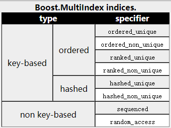
    <br>
    <div style="color:orange; border-bottom: 1px solid #d9d9d9; display: inline-block; color: #999; padding: 2px;">
       indicies
    </div>
</center>

- Ordered/Rank Index

实现为一棵红黑树，header 由 3 个指针组成：一个指向父指针，两个指向子指针

- Hashed Index
  实现为"数组+链表"，header 由 2 个指针组成，双向链表

<center>
    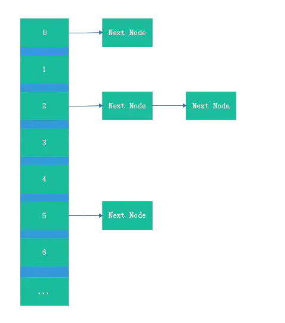
    <br>
    <div style="color:orange; border-bottom: 1px solid #d9d9d9; display: inline-block; color: #999; padding: 2px;">
       array + linked list
    </div>
</center>

- Sequenced Index

实现为双向链表，header 由 2 个指针组成

- Random Access

实现为动态数组，header 由一个指针组成，指向 node 在动态数组中的位置

- 总结

| stl                | multi_index' indice | multi_index' headers | size on 64-bit systems |
| ------------------ | ------------------- | -------------------- | ---------------------- |
| std::set           | Ordered/Rank Index  | 3                    | 24 bytes               |
| std::unordered_set | Hashed Index        | 2                    | 16 bytes               |
| std::list          | Sequenced Index     | 2                    | 16 bytes               |
| std::vector        | Random Access       | 1                    | 8 bytes                |

#### 额外优化：node compression

- 问题背景：
  - Ordered index 和 Ranked index 由红黑树实现，其中有一个 node color 成员,最少需要占据 1bit
  - 在大多数实现中，node color 用 unsigned char 之类的类型表示，由于 alignment 问题，常常占用 8byte(64 位下)，4byte(32 位下)
- 解决思路：
  - 如果指针指向的地址是偶数，那么可以节省指针的最后一个 bit(LSB, Least Significant Bit)，用以存放 node color
  - 在 multi_index 中，可以保证这一要求，因此可以安全地存放
- 性能提升：
  - 与 STL 容器 std :: set 的常见实现相比，节点压缩可以使报头过载减少 25％。
  - 根据官方文档介绍，对于中等大小的容器，此优化对性能的影响可以忽略不计；但是对于十万数量级以上容器，在此优化下的执行速度明显更快
  - 原因：thrashing problem(见后续)

## 测试环境

- 硬件：

  - cpu:

    - 型号: AMD EPYC 7K62 48-Core Processor
    - 核数: 8
    - 架构: x86-64
    - 频率: 2595.124MHz
    - L1d cache: 32K
    - L1i cache: 32K
    - L2 cache: 4096K
    - L3 cache: 16384K

  - memory:
    - 大小：16G
    - 类型：DIMM
    - 速度：19.4 G/s

- 操作系统:

  - 镜像: tLinux 2.2-集成版

- 软件：

  - g++: 8.3.1

  - std: c++14

  - boost: 1.73.0

  - google/benchmark: v1.5.1

## 基本测试

#### 场景假设

- 需求定义：
  - 动态更新用户数据
  - 个人经验值(exp_pers)排名
  - 活跃度(activity)排名
  - 综合(以 exp_pers 和 active 的权重)排名

定义数据结构如下：

```c++
struct User {
    uint32_t uid;   // user id(unique)
    std::string name;   // username
    uint32_t exp_pers;  // personal experience
    uint32_t activity;    // user activity

    uint32_t by_exp_pers() const { return exp_pers; }
    uint32_t by_hybrid() const {
        return exp_pers * 0.7 + activity * 0.3;   // hybrid ranking
    }

    // other assistant functions
    // ...
};
```

#### multi_index 定义

针对上述假设，定义符合上述需求的 multi_index 为：

```c++
typedef boost::multi_index_container<
    User,
    boost::multi_index::indexed_by<
        // index #1: by_exp_pers
        boost::multi_index::ranked_non_unique<
            boost::multi_index::tag<tag_exp_pers>,
            boost::multi_index::
                const_mem_fun<User, uint32_t, &User::by_exp_pers>,
            std::greater<uint32_t>>,    // by descending order
        // index #2: by_activity
        boost::multi_index::ranked_non_unique<
            boost::multi_index::tag<tag_activity>,
            boost::multi_index::member<User, uint32_t, &User::activity>,
            std::greater<uint32_t>>,    // by descending order
        // index #3: by_hybrid
        boost::multi_index::ranked_non_unique<
            boost::multi_index::tag<tag_hybrid>,
            boost::multi_index::const_mem_fun<User, uint32_t, &User::by_hybrid>,
            std::greater<uint32_t>>,    // by descending order
        // index #4: by_order
        boost::multi_index::ordered_unique<
            boost::multi_index::tag<tag_uid>,
            boost::multi_index::member<User, uint32_t, &User::uid>>>>

    container_t;
```

其中前三种索引分别用于三种需求，最后一个索引用于动态更新用户数据

#### 测试数据集生成

- 随机生成引擎：random_device ，非确定性随机数引擎，在不同次执行下产生的序列不同

```c++
std::random_device rd;
```

- 用户数据生成

```c++
static User generate_random_user(uint32_t uid_) {
  User user;
  user.uid = uid_;
  user.name = std::to_string(rd());
  user.exp_pers = rd();
  user.activity = rd();
  return user;
}
```

除 uid 外，用户其余属性完全随机，因此用户在不同排名榜下顺序完全随机

- 查询时用户 uid 生成

```c++
static inline uint32_t generate_random_uid(uint32_t bound) {
  return rd() % bound;
}
```

uid 顺序增长，通过提供 bound(当前最大 uid)随机生成小于 bound 的 uid，保证查询的用户存在且随机

#### 测试规划

- 测试分为两部分

  - 测试不同数量级下，增删改查用户数据的性能

  - 测试不同数量级下，查询用户排名的性能

- 因此，测试流程为：

  1. 预置条件：随机插入 size 个用户数据，准备 iter_cnt 个测试数据

     - 在增、改用户数据时，测试数据为 iter_cnt 个 User
     - 在删、查以及查询用户排名时，测试数据为 iter_cnt 个 uid
     - 通过这样方法，预置条件准备完成，且都在 memory 甚至是 cache 中，避免最终得出的时间有随机生成数据以及 multi_index 集合达到数量级这两个时间的噪声

  2. 计时测试：迭代执行 iter_cnt 次操作，得出在 size 数量级下 iter_cnt 次操作的平均时间，通过 iter_cnt 次操作衡量性能可以避免偶然性

- 在接下来测试中，设置 size 从 2^10 到 2^19，每次乘以 2 变化；iter_cnt 恒定为 100

#### 测试工具：google/benchmark

- google/benchmark 集成自 googletest，提供了以下特性
  - 通过提供宏来简化测试脚本中繁杂的计时代码、参数设置代码、环境部署代码，使得程序员可以把更多精力放在测试逻辑本身
  - 提供纳秒级计时精确度，将测试代码智能执行多次（耗时长的测试执行次数少，耗时短的测试执行次数多）取平均，以获得精准的测试结果
  - 记录总执行时间和 cpu 调度到测试任务的执行时间，有效避免多任务时，系统其他程序和调度策略对测试的影响

<center>
    <div style="display:inline">
        
    </div>
</center>

例如，

```c++
static void Args_basic(benchmark::internal::Benchmark* b) {
  for ( i : boost::irange(10, 20)) b->Args({1 << i, 100});
}

static void BM_get_exp_pers_rank(benchmark::State& state) {
  // pre-set part
  Ranking rank;
  std::set<uint32_t> test_data;
  init_env_uid(state.range(0), state.range(1), rank, test_data);

  // timing part
  for ( _ : state) {
    for ( data : test_data) rank.get_exp_pers_rank(data);
  }
}
BENCHMARK(BM_get_exp_pers_rank)->Apply(Args_basic);
```

测试计划中的参数通过 Args_basic 指定，测试获取 exp_pers 排名时，在循环外部分为预设条件部分，不计时；循环内为测试部分，自动计时，自动报告

#### 测试结果

- 执行测试

<center>
    <div style="display:inline">
        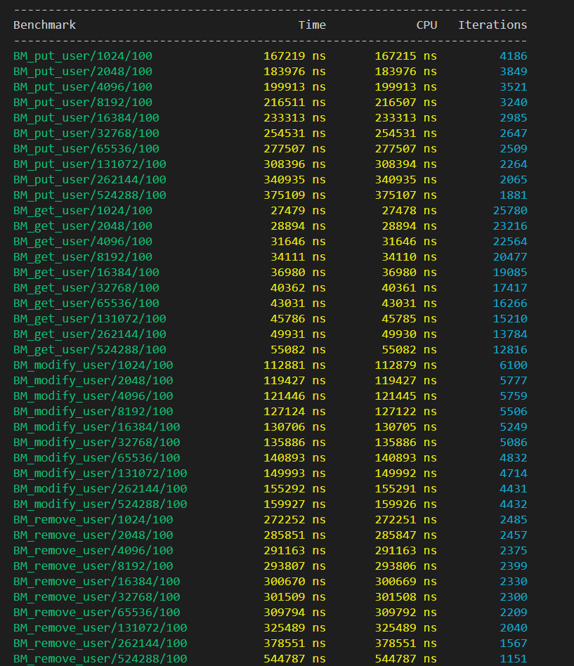
    </div>
    <br>
    <div style="color:orange; border-bottom: 1px solid #d9d9d9; display: inline-block; color: #999; padding: 2px;">
        test_basic
    </div>
</center>

- 增删改查用户数据

<center>
    <div style="display:inline">
        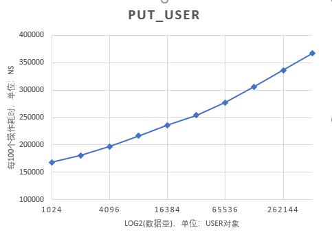 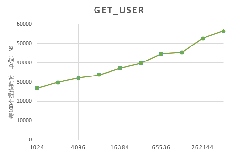
    </div>
    <div style="display:inline">
        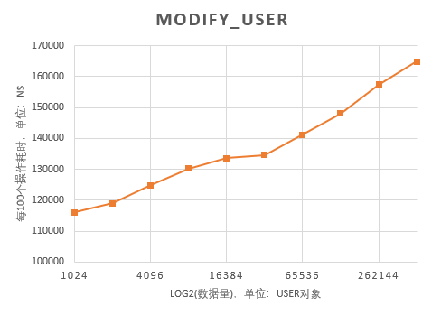 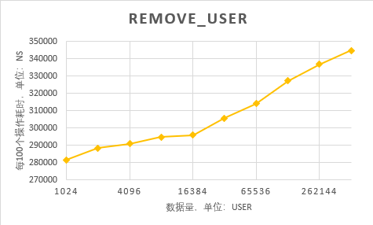
    </div>
    <div style="display:inline">
        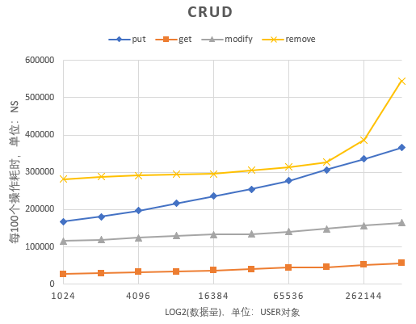
    </div>
    <br>
    <div style="color:orange; border-bottom: 1px solid #d9d9d9; display: inline-block; color: #999; padding: 2px;">
        crud user data
    </div>
</center>

注：横坐标为对数坐标

- 查询用户排名

<center>
    <div style="display:inline">
        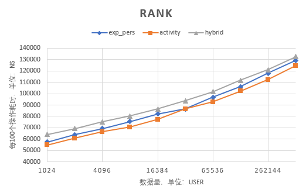
    </div>
    <br>
    <div style="color:orange; border-bottom: 1px solid #d9d9d9; display: inline-block; color: #999; padding: 2px;">
        user's rank
    </div>
</center>

注：横坐标为对数坐标

#### 结果分析

- 增删改查用户数据

  1. 从图表可以看出，put、modify、get 三个操作呈现良好的直线，由于是对数坐标，说明他们的时间复杂度是 O(n)
  2. 另外从综合图上可以看到，耗时上排序为 get < modify < put < remove，这也容易理解，因为 modify 如果修改前后位置不变，则只需要 O(1)的时间更新一下，如果修改后位置改变，则需要调整树的结构
  3. 发现 remove 操作有在 16384 前后有明显变化，因此用 perf 查看 cache 情况

依次把 2^10 到 2^19 的数据量的测试用以下指令监控

```c++
perf stat -e cache-references -e cache-misses ./test_basic
```

<center>
    <div style="display:inline">
        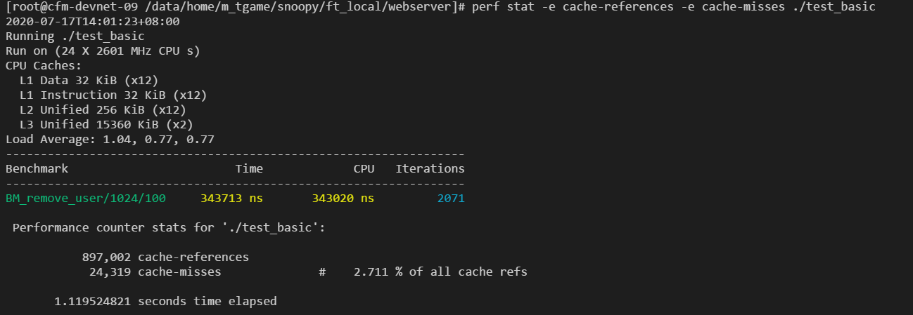
    </div>
    <br>
    <div style="color:orange; border-bottom: 1px solid #d9d9d9; display: inline-block; color: #999; padding: 2px;">
        perf
    </div>
</center>

得到 cache refs:cache misses 的图表如下：

<center>
    <div style="display:inline">
        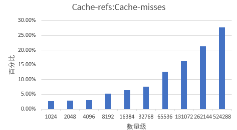
    </div>
    <br>
    <div style="color:orange; border-bottom: 1px solid #d9d9d9; display: inline-block; color: #999; padding: 2px;">
        perf
    </div>
</center>

可以看出，refs:misses 递增曲线有明显折点，这说明虽然数据量加大，随机删除节点的过程中会出现较大的 cache misses，导致了性能下降；而 get、modify 这种状况不明显，是因为 get、modify 涉及的数据结构调整较小；而 put 操作中，user 的 uid 递增，相当于是向树的末尾追加，也不会影响大范围调整。

- 查询用户排名

我们发现在查询 rank 时，ranked index 的性能非常稳定，在一般的红黑树实现中并没有提供此类功能，因此有必要查看一下源码实现，Ranked Index 提供了两种查询排名的方法：

1. 根据 node 的位置查询(pointer)

接口为：

```c++
size_type rank(iterator position)const
{
  BOOST_MULTI_INDEX_CHECK_VALID_ITERATOR(position);
  BOOST_MULTI_INDEX_CHECK_IS_OWNER(position,*this);

  return ranked_index_rank(
    position.get_node()->impl(),this->header()->impl());
}
```

实现为：

```c++
template<typename Pointer>
inline typename ranked_node_size_type<Pointer>::type
ranked_index_rank(Pointer x,Pointer end_)
{
  typedef typename ranked_node_size_type<Pointer>::type size_type;

  Pointer top=end_->parent();
  if(top==Pointer(0))return 0;
  if(x==end_)return top->size;

  size_type s=ranked_node_size(x->left());
  while(x!=top){
    Pointer z=x->parent();
    if(x==z->right()){
      s+=ranked_node_size(z->left())+1;
    }
    x=z;
  }
  return s;
}
```

可以看出逻辑是：

1. 考虑到 left subtree 整体比 right subtree 小，因此首先赋值：rank <- 当前 node 的 left child size
2. 获取 parent node，如果当前 node 是 right child，说明 parent node 的 left child 也比当前 node 小，操作：rank <- rank + parent node's left child size + 1(1 代表 parent node 也比当前 node 小)
3. 当前 node <- parent node
4. 迭代 2-3 步，直到到达 top node 结束

上述步骤中，获取 size 时间为 O(1)，从子节点遍历到最顶部节点的迭代过程中，迭代次数最坏情况为树的高度，而根据红黑树的定理：**一棵含有 n 个节点的红黑树的高度至多为 2log(n+1).**因此次数为 O(logn)，综合下来，时间复杂度为 O(logn)，与我们测试结果一致

2. 根据 node 的值查询(value)

接口为：

```c++
template<typename CompatibleKey,typename CompatibleCompare>
size_type find_rank(
  const CompatibleKey& x,const CompatibleCompare& comp)const
{
  return ranked_index_find_rank(
    this->root(),this->header(),this->key,x,comp);
}
```

实现为：

```c++
template<
  typename Node,typename KeyFromValue,
  typename CompatibleKey,typename CompatibleCompare
>
inline typename Node::size_type ranked_index_find_rank(
  Node* top,Node* y,const KeyFromValue& key,const CompatibleKey& x,
  const CompatibleCompare& comp,mpl::false_)
{
  typedef typename Node::size_type size_type;

  if(!top)return 0;

  size_type s=top->impl()->size,
            s0=s;
  Node*     y0=y;

  do{
    if(!comp(key(top->value()),x)){
      y=top;
      s-=ranked_node_size(y->right())+1;
      top=Node::from_impl(top->left());
    }
    else top=Node::from_impl(top->right());
  }while(top);

  return (y==y0||comp(x,key(y->value())))?s0:s;
}
```

可以看出逻辑是：

1. 传入的参数 top node 一般调用下为根节点，如接口所示；赋值: rank <- top node's size(即整个树的大小)
2. 比较 top node's value 与 value:
   1. 如果 top node's value 大，说明 value 应属于 left subtree，说明当前 rank 应该减去整个 right subtree size 以及 top node，因此调整 rank <- rank - (left child's size + 1)，并赋值: top node <- top node' left child，y 表示 rank 最后一次调整时 top node 的位置
   2. 如果 value 大，说明 value 属于 right subtree,目前没有依据调整 rank，赋值: top node <- top node' right child
3. 迭代执行 2 步，直到 top node 不存在
4. 迭代结束后的 y 位置即代表 value 应该在的位置，y 的 left child 全部小于 y，y 的 right child 全部大于 y，此时比较 y 的 value 和 value，如果相等，返回 value；否则，说明 value 不在树中，返回整个树的大小表示错误

迭代次数同第一部分，只不过这次是从上往下遍历，而第一部分是从下往上遍历，因此迭代次数是 O(logn)；同样的，查询 size 的时间复杂度是 O(1)；因此整体时间复杂度是 O(logn)，与我们测试结果一致

3. 总结

- size，对于上述查询 size 为 O(1)，实现为 node 中额外记录他的子树以及他自身的 size，在增加、删除元素时：

  1. 首先递归向上更新 size++或 size--
  2. 其次在结构调整时

<center>
    <div style="display:inline">
        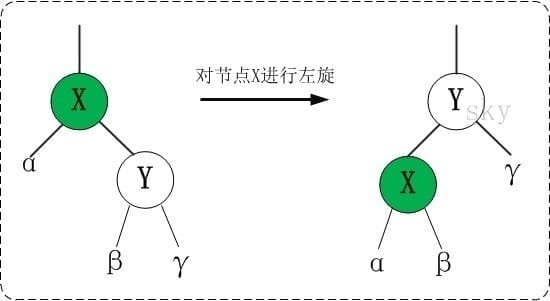 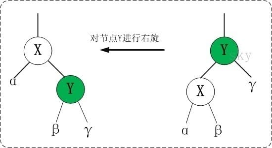
    </div>
    <br>
    <div style="color:orange; border-bottom: 1px solid #d9d9d9; display: inline-block; color: #999; padding: 2px;">
        rotate
    </div>
</center>

- 左旋(伪代码)

```c++
// pseudo code
x.size = α.size + β.size + 1
y.size = x.size + γ.size + 1
```

- 右旋(伪代码)

```c++
// pseudo code
y.size = α.size + β.size + 1
x.size = y.size + γ.size + 1
```

- Ranked Index 对查询排名的实现效率高且稳定

## 对比测试

#### 场景假设

- 在这部分，我们对实现设想 1（多个 stl）和 multi_index 做对比，比较他们性能的差距

```c++
struct A {
    A(int _x, int _y) :
      x(_x), y(_y)
    {)

    int x;
    int y;
};
```

需要及时获取根据 x，y 的排名，以及修改 x，y 的值

- naive 实现 1：

```c++
struct CompX {
    bool operator()(const A& lhs, const A& rhs) const { return lhs.x < rhs.x; }
};

struct CompY {
    bool operator()(const A& lhs, const A& rhs) const { return lhs.y < rhs.y; }
};

std::set<A, CompX> x_asc;
std::set<A, CompY> y_asc;
std::unordered_set<A> h;
```

- multi_index 实现：

```c++
namespace tags {
    struct x_asc {};
    struct y_desc{};
    struct unordered {};
}

using sorted_ints = boost::multi_index_container<
  A,                          // the stored object
  indexed_by<
    ordered_unique<           // first view
      tag<tags::x_asc>,       // tag used to access the view
      member<A, int, &A::x>,  // ordered on x
      std::less<int>          // by ascending order
    >,
    ordered_unique<           // second view
      tag<tags::y_asc>,       // tag used to access the view
      member<A, int, &A::y>,  // ordered on y...
      std::less<int>          // by ascending order
    >
  >
>;
```

#### 测试数据集生成

同基本测试

#### 测试规划

- 对 multi_index 和实现 1 下的 stl 做以下操作
  - 删除
  - 遍历
  - 查找
  - 插入

```c++
static const int Iterations = 1e6;
```

为保证测试的稳定性，做 10^6 次操作

#### 测试结果

<center>
    <div style="display:inline">
        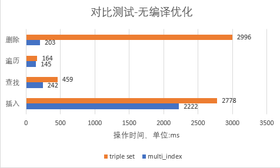 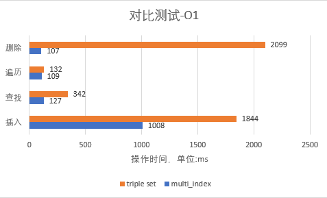
    </div>
    <br>
    <div style="display:inline">
        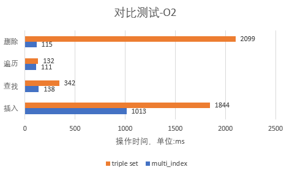 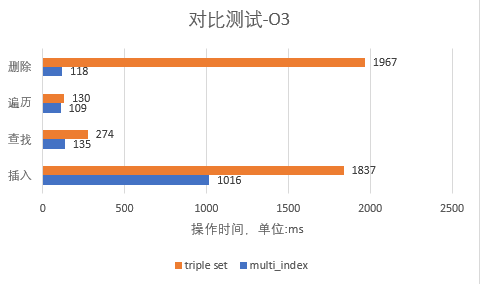
    </div>
    <br>
    <div style="display:inline">
        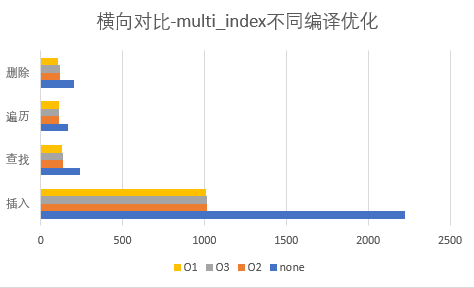
    </div>
    <br>
    <div style="color:orange; border-bottom: 1px solid #d9d9d9;
    display: inline-block;
    color: #999;
    padding: 2px;">comparison test</div>
</center>

#### 结果分析

- 平均下来，multi_index 比实现 1 性能提升

| 删除     | 遍历    | 查找    | 插入    |
| -------- | ------- | ------- | ------- |
| 16.75 倍 | 1.09 倍 | 2.16 倍 | 1.58 倍 |

- 另外，从优化选项上看，O1，O2，O3 优化选项之间差距不大，但是，O1 相较于无编译优化下性能提升

| 删除    | 遍历    | 查找    | 插入    |
| ------- | ------- | ------- | ------- |
| 2.20 倍 | 1.91 倍 | 1.33 倍 | 1.90 倍 |

因此，在实际使用时，可以用 O1 优化

## 共享内存测试

#### 场景假设

- 在实际应用时，需要保证数据持久化，也需要进程间共享以并行,因此尝试将数据放到共享内存做测试

#### boost.interprocess 原理介绍

- mmap 逻辑（mmap 可将文件映射到虚拟内存空间中）

  1. mmap 时分配虚拟地址，并标记此段虚拟地址与该文件的 inode 绑定
  2. 访问 mmap 返回的虚拟地址时，触发缺页中断
  3. 缺页中断处理函数，通过虚拟地址，找到该文件的 inode
  4. 从磁盘中将 inode 中对应的数据读到内存页中
  5. 将内存页映射添加到页表中

- managed_shared_memory：boost.interprocess 提供的共享内存接口
  - 不同进程以同样参数调用 mmap，获得共享内存，写入的数据会持久化到磁盘

以下把 multi_index_container 放到共享内存中用于测试

```c++
segment = new boost::interprocess::managed_shared_memory(
        boost::interprocess::create_only, "Shared-Memory", 1 << 28);

users = segment->construct<container_t>("Ranking Container")(
    container_t::ctor_args_list(), segment->get_allocator<User>());
```

#### 测试规划

- 在基本测试中已测试了 in-memory 情况下的耗时，现在加入共享内存后，再测一遍做对比

#### 测试结果

- 增删改查用户数据

<center>
    <div style="display:inline">
        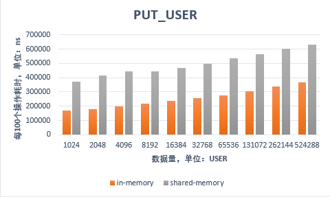 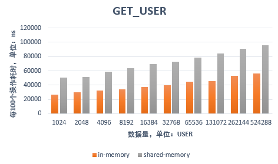
    </div>
    <div style="display:inline">
        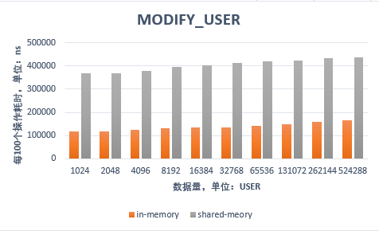 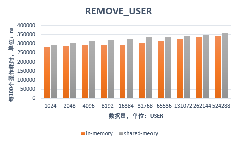
    </div>
    <br>
    <div style="color:orange; border-bottom: 1px solid #d9d9d9; display: inline-block; color: #999; padding: 2px;">
        crud comparison
    </div>
</center>

- 查询用户排名

<center>
    <div style="display:inline">
        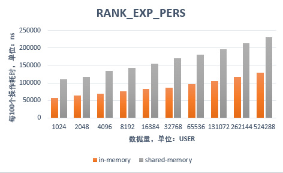 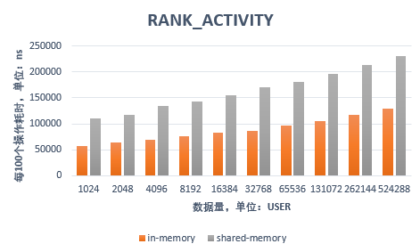
    </div>
    <div style="display:inline">
        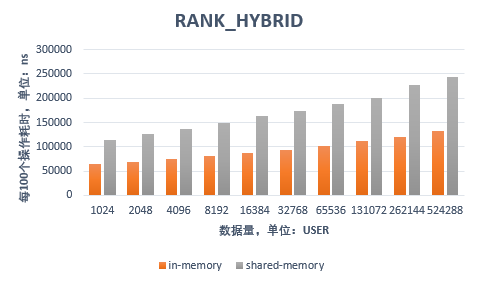
    </div>
    <br>
    <div style="color:orange; border-bottom: 1px solid #d9d9d9; display: inline-block; color: #999; padding: 2px;">
        rank comparison
    </div>
</center>

#### 结果分析

- 增删改查用户数据

  1. 可以看出，put、modify、get 三个操作 shared-memory 比 in-memory 性能下降 1 倍到 1.5 倍，符合预期
  2. 另外 remove 操作中，shared-memory 与 in-memory 下 remove 操作十分接近，这是因为删除操作不涉及对数据的访问，只涉及对红黑树的调整，因此两者接近

- 查询用户排名

  - 可以看出，同上所述，shared-memory 比 in-memory 性能下降 1 倍到 1.5 倍，符合预期

## 实际场景下的优化方向

#### 分片树

- 问题：不能并行，multi_index 串行执行各个查询请求，在面对海量请求时，会有性能瓶颈

- 解决：把 multi_index 数据结构分成多块，每块存储一部分数据，对数据的增删改查只需要涉及其中一块；获取索引从多块获取，最后求和即可

<center>
    <div style="display:inline">
        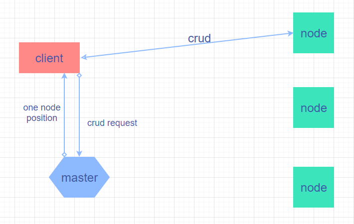 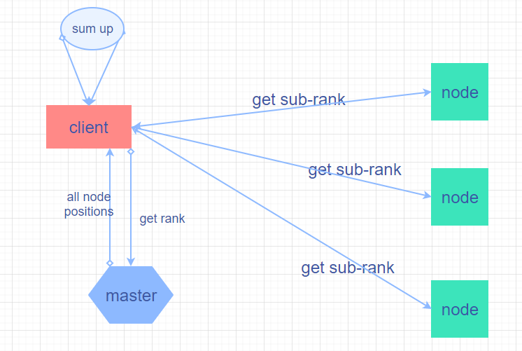
    </div>
    <br>
    <div style="color:orange; border-bottom: 1px solid #d9d9d9; display: inline-block; color: #999; padding: 2px;">
        distributed ranking system
    </div>
</center>

#### 打标签

- 问题：Thrashing Problem，千万级数量级下，cache/memory 总需求过大，工作集超过 cache/memory，过于频繁的 cache 替换/缺页异常；

- 本质：而这种频繁的请求是由于：替换时错误的把关键数据结构 evict，而把只读一次的数据存放在 cache/memory 中

<center>
    <div style="display:inline">
        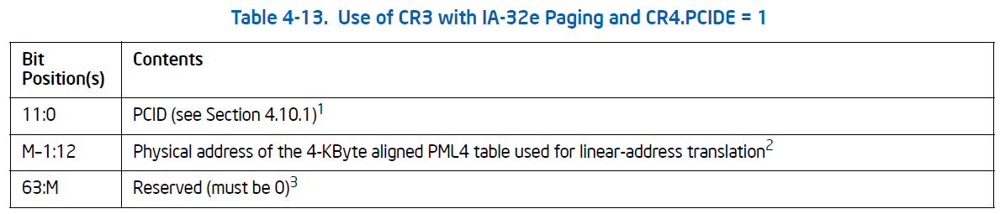
    </div>
    <br>
    <div style="color:orange; border-bottom: 1px solid #d9d9d9; display: inline-block; color: #999; padding: 2px;">
        example: PCID for TLB in x86
    </div>
</center>

- 解决：对 multi_index 的 node 结构打标签，value 不打，在 cache/memory 替换时，打标签的数据不会被 evict，这样 multi_index 的核心数据结构永远在 cache/memory 中，即使数量级进一步，影响的只是读取数据的操作，而遍历树的过程不受到影响
